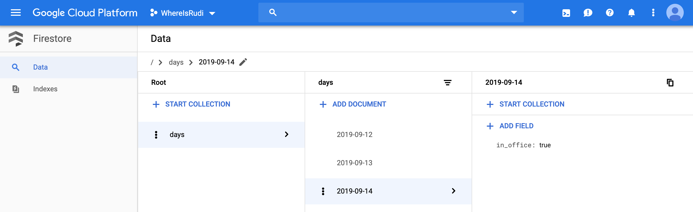

# WhereIsRudi :dog:

*WhereIsRudi* is an interactive [Slack](https://slack.com) app to inform your colleagues whether your dog@work is in the office today! :tada:

## Usage

### Colleagues

Use the [Slash Command](https://api.slack.com/slash-commands) `\whereisrudi` in any channel, direct message or any other slack conversation. That's it!

### Dog Owner

You will get a message every (working day) morning to ask you whether you bring your dog to the office today. Just answer with one tap or click via the actions in the message. It's that easy!

## Architecture & Sequence

## Installation/Deployment

For easier deployment, the infrastructure as code software tool [Terraform](https://www.terraform.io/) is used.

#### Preparations

1. Install Terraform: [https://learn.hashicorp.com/terraform/getting-started/install.html](https://learn.hashicorp.com/terraform/getting-started/install.html)
2. Run preparation script:
    1. Run `prepare_gcp.sh`: `bash prepare_gcp.sh`. You may run this in the [Google Cloud Shell editor](https://ssh.cloud.google.com/cloudshell/editor). This will:
        - Create a Google Cloud Platform project.
        - Create Service Account and bind the roles `roles/owner`, `roles/iam.serviceAccountUser`, `roles/storage.admin`, `roles/appengine.appAdmin`, `roles/cloudscheduler.admin`, `roles/pubsub.editor` and `roles/cloudfunctions.developer`.
        - Create new private key for the Service Account and save in the file `account.json`.
        - Enable the Google Cloud Platform APIs `appengine`, `cloudfunctions` and `cloudscheduler`.
    2. Copy the file `account.json` into the `deployment` folder.
3. You may need to enable billing for the created project.

#### Deployment

1. Commands need to be run in `deployment` folder: `cd /deployment`
2. Initialize the Terraform working directory: `terraform init`
3. Generate and show the Terraform execution plan: `terraform plan`
4. Build the infrastructure: `terraform apply` and confirm with `yes`

To destroy/delete the infrastructure: `terraform destroy` and confirm with `yes`

### Google Cloud Platform Resources

The following [Google Cloud Platform](https://console.cloud.google.com) resources are created via Terraform:

#### Google Cloud Function

Three cloud functions with environment variables:
- `gather-information` (triggered by Google Pub/Sub topic `gather-information-schedule`)
    - `SLACK_API_TOKEN`: Slack App *OAuth Access Token* (starting with `xoxp-`)
    - `USER_ID`: Slack user id of dog owner.
- `slack-actions` (triggered by HTTP)
    - `SLACK_API_VERIFICATION_TOKEN`: Slack App Verification Token
- `slack-slash-commands` (triggered by HTTP)
    - `SLACK_API_VERIFICATION_TOKEN`: Slack App Verification Token

#### Google Cloud Scheduler

Google Pub/Sub topic `gather-information-schedule` should be triggered every working day (monday - friday) at 7:30 AM.

Therefore the frequency is set to `30 7 * * 1-5`.

#### Google Cloud Firestore

The cloud functions create a collection called `days`. The documents' id is the day string (i.e. `2019-09-14`). The documents only have one boolean field `in_office`.

### Slack API/App

#### Slack App

Create a new Slack app ([https://api.slack.com/apps](https://api.slack.com/apps)).

#### Bot User

Create a Bot User, i.e. `WhereIsRudi`.

#### OAuth & Permissions

In OAuth & Permissions in Scopes, add permission scope `chat:write:bot` and `incoming-webhook` to *Conversations* and `bot` and `commands` to *Interactivity*.

#### Interactive Components

Add Interactivity request URL pointing to your Google Cloud Function `slack-actions`.

#### Slash Commands

Create new Slash command `/whereisrudi` with request URL pointing to your Google Cloud Function `slack-slash-commands`, i.e. `https://europe-west1-<your-project-name>.cloudfunctions.net/<your-function-name>`.
